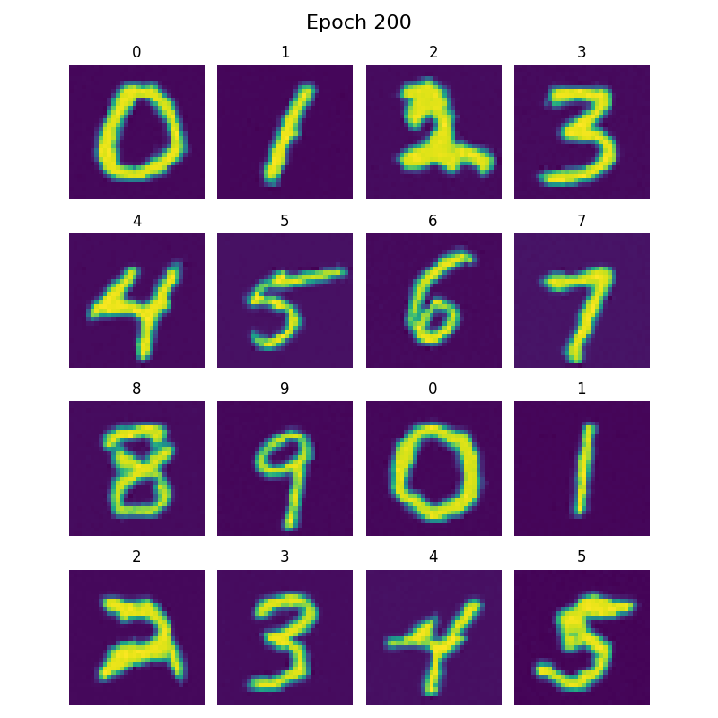

# Flow Matching

A comprehensive PyTorch implementation of **Flow Matching** for generative modeling, featuring both simple MLP-based models and advanced Diffusion Transformer (DiT) architectures for conditional image generation.


You can find an extended blog assoicated with this repository [here](https://mirxonius.github.io/2026-02-02-flow-matching-notes/).

## Overview

Flow Matching is a simulation-free approach for training continuous normalizing flows (CNFs) that learns to transform samples from a simple noise distribution to a complex target distribution. This implementation provides:

- **Simple Flow Matching**: MLP-based models for simple N-dimensional data data
- **DiT Flow Matching**: Vision Transformer architecture for conditional image generation
- **Optimal Transport**: Optional OT-based coupling for improved training
- **Classifier-Free Guidance**: Advanced conditional generation with controllable guidance
- **Multiple Integration Methods**: Euler and RK4 solvers for sampling

## Features

### 🎯 Two Model Types

**1. Simple Flow Matching (`FlowMatchingModel`)**
- MLP-based velocity model for 1D and ND flat data
- Perfect for learning simple distributions
- Fast training and inference

**2. DiT Flow Matching (`DiTFlowMatchingModel`)**
- Vision Transformer (ViT) based architecture
- Conditional generation with labels
- Classifier-free guidance support
- Adaptive Layer Norm (adaLN) conditioning
- Multi-scale positional embeddings

### 🚀 Key Capabilities

- ✅ **Conditional Generation**: Generate samples conditioned on class labels
- ✅ **Guidance Control**: Adjust guidance scale for quality vs. diversity trade-off
- ✅ **Optimal Transport**: Optional OT coupling for better sample pairing
- ✅ **Multiple Solvers**: Euler (fast) and RK4 (accurate) integration methods
- ✅ **Training Visualization**: Automatic sample visualization during training
- ✅ **Flexible Architecture**: Easy to extend with custom velocity models

## Installation

```bash
# Clone the repository
git clone https://github.com/yourusername/flows.git
cd flows

# Install dependencies
pip install torch torchvision tqdm matplotlib numpy einops POT
```

## Quick Start

### Simple Flow Matching (2D Data)

```python
from src.model import FlowMatchingModel
from src.train_flow import train_flow_model
from torch.utils.data import DataLoader
import torch.nn as nn

# Create model
model = FlowMatchingModel(
    data_dims=2,        # 2D data
    hidden_dim=64,      # Hidden dimension
    num_layers=4,       # MLP depth
    dt=1e-2            # Integration step
)

# Train
trained_model = train_flow_model(
    model=model,
    dataloader=your_dataloader,
    loss_fn=nn.MSELoss(),
    num_epochs=100,
    lr=1e-3,
    device="cuda",
    optimal_transport=True
)

# Sample
samples = trained_model.sample(num_samples=100)
```

### DiT Flow Matching (Conditional Image Generation)

```python
from src.model import DiTFlowMatchingModel, ViTVelocityModel
from src.train_flow import train_dit_flow_model
from torch.utils.data import DataLoader
import torch.nn as nn

# Create velocity model
velocity_model = ViTVelocityModel(
    input_size=32,              # 32x32 images
    patch_size=4,               # 4x4 patches
    in_channels=1,              # Grayscale
    model_dim=128,              # Model dimension
    num_heads=8,                # Attention heads
    depth=6,                    # Transformer depth
    num_classes=10,             # Number of classes
    class_dropout_prob=0.2      # For classifier-free guidance
)

# Create flow matching model
model = DiTFlowMatchingModel(
    velocity_model=velocity_model,
    data_shape=(1, 32, 32),     # Image shape
    dt=5e-3                     # Integration step
)

# Train
trained_model = train_dit_flow_model(
    model=model,
    dataloader=mnist_dataloader,  # (image, label) pairs
    loss_fn=nn.MSELoss(),
    num_epochs=200,
    lr=1e-3,
    device="cuda",
    optimal_transport=False,
    weight_decay=0.05,
    plot_every=20,
    save_path="results"
)

# Sample with guidance
labels = torch.tensor([0, 1, 2, 3, 4, 5, 6, 7, 8, 9]).cuda()
samples = trained_model.sample(
    guidance=labels,
    guidance_scale=3.0,          # Higher = more guided
    integration_method="fast_rk4"
)
```

## Results

### MNIST Conditional Generation (Epoch 200)

Our DiT Flow Matching model trained on MNIST with classifier-free guidance (scale=3.0):



*Conditionally generated MNIST digits (0-9) showing high quality and diversity. The model successfully learns to generate each digit class with clear, recognizable features.*

**Training Details:**
- Model: ViT-based (128 dim, 6 layers, 8 heads)
- Dataset: MNIST (32x32, normalized)
- Training: 200 epochs, AdamW optimizer (lr=1e-3, weight_decay=0.05)
- Guidance: Classifier-free guidance with dropout_prob=0.2
- Integration: Fast Euler method with dt=5e-3

The model demonstrates:
- ✅ Strong class conditioning (each digit is recognizable)
- ✅ High sample quality with smooth, well-formed digits
- ✅ Good diversity within each class
- ✅ Effective classifier-free guidance at scale 3.0

## Project Structure

```
flows/
├── src/
│   ├── __init__.py
│   ├── utils.py                    # Utilities (OT sampling, model size, etc.)
│   ├── callbacks.py                # Visualization callbacks
│   ├── train_flow.py               # Training functions
│   └── model/
│       ├── __init__.py
│       ├── FlowMatchingModel.py    # Simple flow matching model
│       ├── DiTFlowMatchingModel.py # DiT-based flow matching
│       ├── velocity_models.py      # Velocity model implementations
│       ├── layers.py               # DiT layers (PatchEmbed, DiTBlock, etc.)
│       ├── LabelEmbedder.py        # Label embedding with CFG
│       ├── TemporalEmbedding.py    # Time embeddings
│       ├── utils.py                # Model utilities
│       └── blocks.py               # Basic building blocks
├── notebooks/
│   ├── flow_matching_workshop.ipynb
│   └── VISUALIZATIONS.md           # Flow field visualizations
├── resources/
│   ├── Flow_Matching.md            # Theory and derivations
│   ├── density_evolution.gif       # Flow visualizations
│   ├── flow_field.gif
│   └── ...                         # More visualizations
└── README.md
```

## Visualizations

For detailed visualizations of probability density evolution, flow velocity fields, and sample trajectories, see [twoo_moon_results/README.md](twoo_moon_results/README.md).

Key visualizations include:
- **Probability Distribution Paths**: How distributions evolve over time
- **Flow Velocity Fields**: Vector fields showing the learned flow
- **Sample Trajectories**: Individual particle paths from noise to data
- **Optimal Transport vs. Regular**: Comparison of coupling methods

## Theory

Flow Matching learns a time-dependent velocity field `v(x, t)` that defines an ordinary differential equation (ODE):

```
dx/dt = v(x, t)
```

Starting from noise `x(0) ~ N(0, I)`, we can integrate this ODE to obtain samples `x(1)` from the target distribution.

**Key advantages:**
- 🎯 Simulation-free training (no need to solve ODEs during training)
- 🚀 More stable than score-based diffusion models
- 🎨 Supports conditional generation naturally
- ⚡ Fast sampling with few integration steps

For detailed mathematical derivations, see [resources/Flow_Matching.md](resources/Flow_Matching.md).


### Different Integration Methods

```python
# Fast Euler (fewer steps, faster)
samples = model.sample(
    guidance=labels,
    integration_method="fast_euler",
    guidance_scale=3.0
)

# RK4 (more accurate, slower)
samples = model.sample(
    guidance=labels,
    integration_method="fast_rk4",
    guidance_scale=3.0
)
```

### Guidance Scale Exploration

```python
# Lower guidance (more diversity, less fidelity)
samples_low = model.sample(guidance=labels, guidance_scale=1.0)

# Medium guidance (balanced)
samples_med = model.sample(guidance=labels, guidance_scale=3.0)

# High guidance (more fidelity, less diversity)
samples_high = model.sample(guidance=labels, guidance_scale=5.0)
```

## Citation

If you use this code in your research, please cite:

```bibtex
@article{lipman2022flow,
  title={Flow Matching for Generative Modeling},
  author={Lipman, Yaron and Chen, Ricky T. Q. and Ben-Hamu, Heli and Nickel, Maximilian and Le, Matthew},
  journal={arXiv preprint arXiv:2210.02747},
  year={2022}
}

@inproceedings{peebles2023dit,
  title={Scalable Diffusion Models with Transformers},
  author={Peebles, William and Xie, Saining},
  booktitle={ICCV},
  year={2023}
}
```

## References

- [Flow Matching for Generative Modeling](https://arxiv.org/abs/2210.02747)
- [Scalable Diffusion Models with Transformers (DiT)](https://arxiv.org/abs/2212.09748)
- [Classifier-Free Diffusion Guidance](https://arxiv.org/abs/2207.12598)
- [Optimal Transport Conditional Flow Matching](https://arxiv.org/abs/2302.00482)

## License

MIT License - feel free to use this code for your research and projects!

## Contributing

Contributions are welcome! Please feel free to submit a Pull Request.

## Acknowledgments

This implementation combines ideas from:
- Flow Matching (Lipman et al., 2022)
- Diffusion Transformers / DiT (Peebles & Xie, 2023)
- Classifier-Free Guidance (Ho & Salimans, 2022)
- Optimal Transport methods

Special thanks to the flow matching and diffusion model communities for their groundbreaking work!
